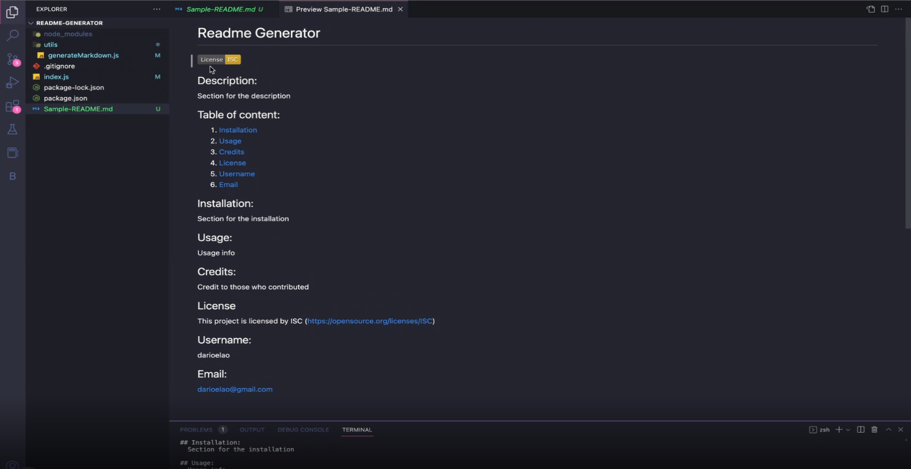

# README Generator

## Description:
  This is app is designed to generate a professional README.md file to attach to the users project. 

## Table of content:
1. [Installation](#installation)
2. [Usage](#usage)
3. [Username](#username)
4. [Email](#email)

## Installation:
1. Open the index.js file in your terminal with the command: 'node index.js'
2. Answer the questions with your desire information for your README file
3. Right click on the new generated README file and open it as preview to review the content

## Usage:

## License
  None

## Github Username:
  https://github.com/darioelaoao

## Email:
  darioelao@gmail.com